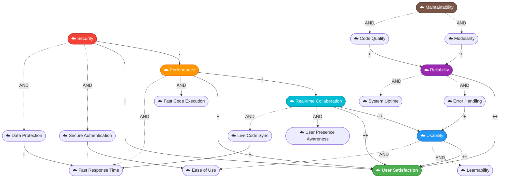

# Soft Goal Interdependency (SIG) Diagram - Collaborative IDE

## Overview
This diagram shows the relationships between non-functional requirements (soft goals) for the Collaborative IDE system.

## Legend
- `++` = Strong positive contribution (MAKE)
- `+` = Positive contribution (HELP)
- `-` = Negative contribution (HURT)
- `--` = Strong negative contribution (BREAK)
- `AND` = All sub-goals must be satisfied
- `OR` = At least one sub-goal must be satisfied

---

## SIG Diagram

---

## Soft Goals Summary Table

| Soft Goal | Type | Description |
|-----------|------|-------------|
| **User Satisfaction** | Top Goal | Ultimate quality objective |
| **Usability** | Primary | System is easy to use and learn |
| **Performance** | Primary | System responds quickly |
| **Security** | Primary | User data and code is protected |
| **Reliability** | Primary | System is stable and available |
| **Real-time Collaboration** | Primary | Multiple users can work together |
| **Maintainability** | Primary | System is easy to maintain/extend |

---

## Key Trade-offs

1. **Security vs Performance**: Strong encryption and authentication add latency
2. **Authentication vs Ease of Use**: More secure login = more steps for users
3. **Data Protection vs Response Time**: Encrypting data slows down sync

---

## How to Recreate in StarUML

1. **Create oval/ellipse shapes** for each soft goal (use UseCase elements)
2. **Use Dependency arrows** for contribution links
3. **Label arrows** with `++`, `+`, `-`, `--`
4. **Use dashed lines** for AND/OR decomposition
5. **Color code** by category (optional)

### Element Count:
- **6 Primary Soft Goals** (blue/colored ovals)
- **12 Sub-goals** (smaller ovals)
- **~20 Contribution links** (arrows with labels)
